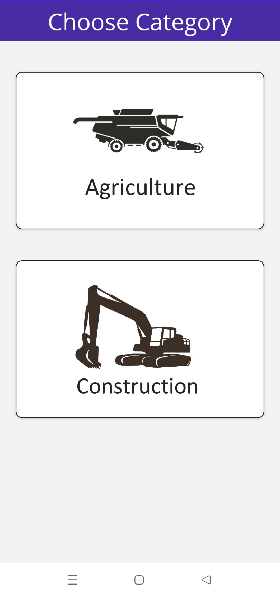
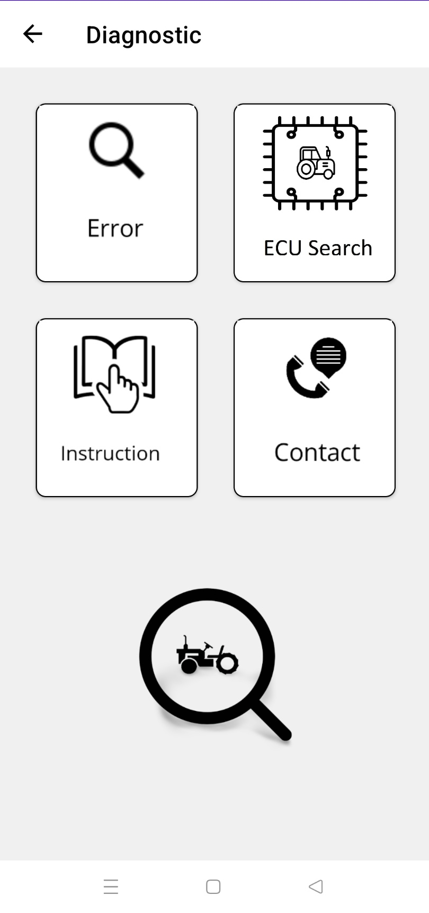

# MAUI Test App

    
    
  

## Description

This repository contains my experiments with creating an Android application using .NET MAUI. This project aims to explore the capabilities of .NET MAUI and understand how to build, deploy, and test an Android application.

## Features

- Cross-platform support (Android, iOS, Windows, Mac)
- Simple user interface
- Basic navigation and user interactions
